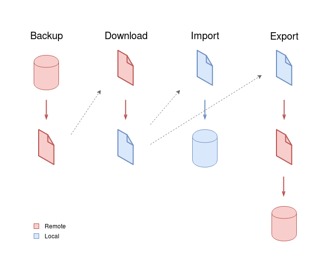

# Ansible playbooks

Initial hint: Make sure you have Ansible configured for human-readable output (`human-readable-output.yaml`). This is automated if Ansible was installed with `quickstart.sh`.

## Configuration

### Project setup

In `group_vars/all.yaml`, change `project_name` and `server_git_url`

### Servers setup

In `inventory.yaml` add each server as an entry in `all.children.remote.hosts`

## Requirements

- [Install Ansible](https://docs.ansible.com/ansible/latest/installation_guide/intro_installation.html). Currently requires Ansible 2.8
- Run `ansible-galaxy install -r requirements.yaml` to install other requirements.

## Usage

### Deploy and update

The two most used tasks have shortcuts.

To deploy to a server, run:
```sh
ansible/deploy.sh [host-or-group]
```
with host-or-group from inventory. If not specified, it targets the `remote` group.

Example: `ansible/deploy.sh development`

To update only:
```sh
ansible/update.sh [host-or-group]
```

### Other scripts

To avoid having too many files in this folder, they were placed inside `playbooks`. They are executed with the `ansible-playbook` command. In addition to the path to the playbook, two more arguments should be used:
- An inventory file. Available servers are stored in `inventory.yaml`. Specify it with `-i inventory.yaml`.
- A subset of the available servers. Use `-l` followed by the name of the server as declared in inventory. (It can also be a list of hosts/groups separated with commas)

For example, to backup the database of the production server, run:
```sh
ansible-playbook -i inventory.yaml -l production playbooks/backup-db.yaml
```

### Working directory

Except for the shortcut scripts, please run Ansible from this directory. It can also be run from other ones, but:
- yaml files require a path
- some tasks use `dirname $PWD` to get the path to the project in localhost

### Quickstart

Because the deploy needs to run the quickstart script, it was converted to an Ansible role. So `quickstart.sh` now installs the requirements and runs only the quickstart role. Some variables are set in `inventory.yaml` to make it work.

### DB



- `backup-db` works as in Fabric.
- `download-db` always takes a new backup and downloads that (if you want to download a previous one, just use `scp`).
- `import-db` by default imports a fresh backup. You can specify a local dump file in the `local_dump` variable (example: `ansible-playbook ... --limit localhost playbooks/import-db.yaml -e local_dump=staging/2019-08-22.dump`).
- `export-db` can be used in two modes:
    - Export local dump to *host_B*: `ansible-playbook ... --limit host_B playbooks/export-db.yaml -e local_dump=staging/2019-08-22.dump`
    - Export remote dump from *host_A* to *host_B*: `ansible-playbook ... --limit host_A,host_B playbooks/export-db.yaml`

Note that the dumps are inside the `playbooks` folder, but paths are relative to it, not `cwd`.

### Media

Same as DB, but replace `local_dump` with `local_archive`

### Project helpers

- `run-django-command`: specify the Django command to be run in the variable `django_command`
- `validate-deployment`: runs tests.
- `service-logs`: shows systemd Django service log.
- `migrate-db`: runs Django migrations.
- `reset-db`: resets DB to initial state. `local_settings` must have `DEBUG = True`.

#### Services

Actions are grouped in playbooks and services are tagged. For example, to restart nginx only, run `ansible-playbook ... --tags nginx playbooks/restart-services.yaml`. There's also a `project` tag that targets both gunicorn and nginx.

Available actions are `install-services`, `start-services`, `restart-services`, `stop-services` and `enable-services`.

## Notes

- DB is automatically backed up when pulling changes. Also, DB/Media are automatically backed up on target machine when using `export`. If they are too big, comment those tasks, and make sure to delete old backups.
- DB name is assumed to be the same as `project_name` (to avoid parsing `local_settings.py`)
- Remote DB dumps are assumed to be stored in `~/db_dumps/`, and Media archives in `~`
- Backup/restore Media doesn't support `relative_path`

## Testing

Tests of deployment with Ansible are made with [Molecule](https://molecule.readthedocs.io). It creates a Vagrant VM (with Ubuntu 18.04 by default), deploys the app in there, and tests that the home page has no broken links.

Tests use Vagrant instead of Docker because the second one is not very well suited to using `systemctl` and having a non-root user.

Multiple distro handling method is taken from [here](https://www.jeffgeerling.com/blog/2018/testing-your-ansible-roles-molecule).

### Setup

- Install [Vagrant](https://www.vagrantup.com/downloads.html) and [VirtualBox](https://www.virtualbox.org/wiki/Linux_Downloads#Debian-basedLinuxdistributions)
- `pip install "molecule[vagrant]>=2.22" "ansible-lint>=4.2.0"`

### Choosing distro to test

Set it in the `MOLECULE_DISTRO` variable when calling `molecule`. By default it is `ubuntu/bionic64` (as specified in `platforms` in `molecule.yml`). To use another Vagrant box, for example CentOS 7, run:
```sh
MOLECULE_DISTRO=centos/7 molecule test
```

To change distro when the instance is already created, run `molecule destroy`

### Running

From this directory, run `molecule test`

### Debugging

VMs are deleted after a failed `molecule test`. Use `molecule converge` to avoid that (you can also use `molecule test --destroy=never` but it runs more steps). You can then examine the VM with `molecule login`

TODO: test quickstart.sh

### Linting everything (TODO)

`ansible-lint` has an [undocumented feature](https://github.com/ansible/ansible-lint/pull/615): running it without supplying playbooks lints all playbooks in the git repository. But `molecule lint` always supplies the `converge` playbook, so that feature cannot be triggered without modifications. TODO: scenarios that test and lint backup/restore playbooks.
