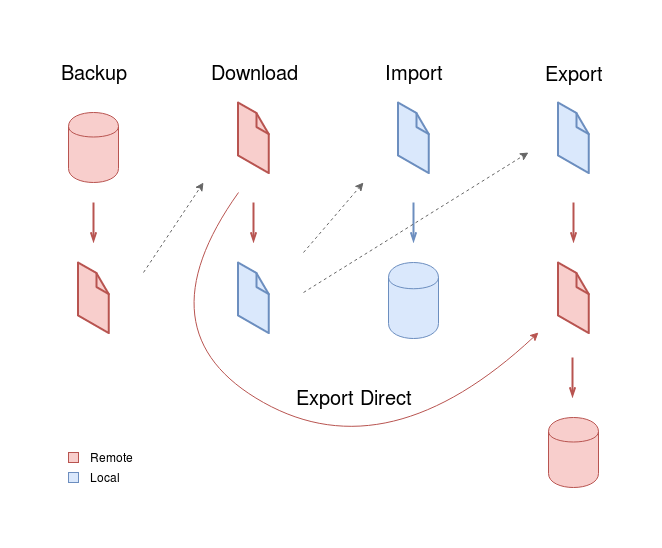

# Ansible playbooks

Initial hint: Make sure you have Ansible configured for human-readable output (`human-readable-output.yaml`). This is automated if Ansible was installed with `quickstart.sh`.

## Configuration

### Project setup

In `group_vars/all.yaml`, change `project_name` and `server_git_url`

### Servers setup

In `inventory.yaml` add each server as an entry in `all.children.remote.hosts`

## Requirements

- [Install Ansible](https://docs.ansible.com/ansible/latest/installation_guide/intro_installation.html). Currently requires Ansible 2.8
- Run `ansible-galaxy install -r requirements.yaml` to install other requirements.

## Usage

### Deploy and update

The two most used tasks have shortcuts.

To deploy to a server, run:
```sh
ansible/deploy.sh [host-or-group]
```
with host-or-group from inventory. If not specified, it targets the `remote` group.

Example: `ansible/deploy.sh development`

To update only:
```sh
ansible/update.sh [host-or-group]
```

### Other scripts

To avoid having too many files in this folder, they were placed inside `playbooks`. They are executed with the `ansible-playbook` command. In addition to the path to the playbook, two more arguments should be used:
- An inventory file. Available servers are stored in `inventory.yaml`. Specify it with `-i inventory.yaml`.
- A subset of the available servers. Use `-l` followed by the name of the server as declared in inventory. (It can also be a list of hosts/groups separated with commas)

For example, to backup the database of the production server, run:
```sh
ansible-playbook -i inventory.yaml -l production playbooks/backup-db.yaml
```

### Working directory

Except for the shortcut scripts, please run Ansible from this directory. It can also be run from other ones, but:
- yaml files require a path
- some tasks use `dirname $PWD` to get the path to the project in localhost

### Quickstart

Because the deploy needs to run the quickstart script, it was converted to an Ansible role. So `quickstart.sh` now installs the requirements and runs only the quickstart role. Some variables are set in `inventory.yaml` to make it work.

### List of playbooks

Here is a summary of the available playbooks (like `fab -l`). There are more details about them in the following sections.

Group | Playbook | Purpose
--- | --- | ---
DB | backup-db | Backs up the DB of a server, to a file in the server.
DB | download-db | Backs up the DB of a server, to a file in your computer.
DB | export-db | Clones the DB from one server to another.
DB | export-direct-db | Clones the DB from one server to another,-------------------------------------
DB | import-db | Clones the DB of a server to your computer.
DB | reset-db | Resets the DB to an empty one.
Media | backup-media | Backs up the Media of a server, to a file in the server.
Media | download-media | Backs up the Media of a server, to a file in your computer.
Media | export-direct-media | TODO
Media | export-media | Clones the Media from one server to another.
Media | import-media | Clones the Media of a server to your computer.
Deploy | deploy | Deploys or updates the application to a server.
Helper | human-readable-output | Configures Ansible to show human-readable output.
Helper | migrate-db | Runs Django migrations.
Helper | run-django-command | Runs a Django (manage.py) command.
Helper | validate-deployment | Runs Django tests.
Services | enable-services | Enables systemd services of the project.
Services | install-services | Installs systemd services of the project.
Services | restart-services | Restarts systemd services of the project.
Services | service-logs | Shows gunicorn service logs.
Services | start-services | Starts systemd services of the project.
Services | stop-services | Stops systemd services of the project.

### DB



- `backup-db` works as in Fabric.

- `download-db` always takes a new backup and downloads that (if you want to download a previous one, just use `scp`).

- `import-db` by default imports a fresh backup. You can specify a local dump file in the `local_dump` variable (example: `ansible-playbook ... --limit localhost playbooks/import-db.yaml -e local_dump=staging/2019-08-22.dump`).

- `export-db` can be used in two modes:
    - Export local dump to *host_B*: `ansible-playbook ... --limit host_B playbooks/export-db.yaml -e local_dump=staging/2019-08-22.dump`
    - Export remote dump from *host_A* to *host_B*: `ansible-playbook ... --limit host_A,host_B playbooks/export-db.yaml`

- `export-direct-db` is like `export-db` from remote to remote, but it directly transfers the file between servers, so very high speeds can be reached if they are in the same datacenter (100 MB/s). `host_B` downloads from `host_A` through HTTP, so it will try to reach `host_A` at `https://{{ server_domain }}:55555`

Note that the dumps are inside the `playbooks` folder, but paths are relative to it, not `cwd`.

### Media

Same as DB, but replace `local_dump` with `local_archive`

By default previous media files are preserved (like in Fabric). Add `-e delete_previous=yes` to delete them.

### Project helpers

- `run-django-command`: specify the Django command to be run in the variable `django_command`
- `validate-deployment`: runs tests.
- `service-logs`: shows systemd Django service log.
- `migrate-db`: runs Django migrations.
- `reset-db`: resets DB to initial state. `local_settings` must have `DEBUG = True`.

#### Services

Actions are grouped in playbooks and services are tagged. For example, to restart nginx only, run `ansible-playbook ... --tags nginx playbooks/restart-services.yaml`. There's also a `project` tag that targets both gunicorn and nginx.

Available actions are `install-services`, `start-services`, `restart-services`, `stop-services` and `enable-services`.

## Notes

- DB is automatically backed up when pulling changes. Also, DB/Media are automatically backed up on target machine when using `export`. If they are too big, comment those tasks, and make sure to delete old backups.
- Remote DB dumps are assumed to be stored in `~/db_dumps/`, and Media archives in `~`
- Backup/restore Media doesn't support `relative_path`
- Media backed up from S3 in a `.tar` loses its metadata.

## External databases

There's support for external databases not running in the server (like RDS) but some manual setup is required. For example, a DigitalOcean managed database comes only with a `defaultdb` database. You must:

- Create a database called `postgres` (the default of the [`maintenance_db` parameter](https://docs.ansible.com/ansible/latest/modules/postgresql_db_module.html#parameters), and also to be able to use `psql`).
- Set DB connection parameters in `local_settings.py`. Either clone the repository and create local_settings from the default file before running deploy (note: remember to manually set DEBUG to False), or let the deploy succeed with a local DB, and then edit local_settings and run deploy again.

## Testing

Tests of Ansible scripts are made with [Molecule](https://molecule.readthedocs.io), which creates a Vagrant VM (with Ubuntu 18.04 by default). The following test scenarios are available:

- `deploy`: deploys the app in the VM, and tests that the home page has no broken links. Then simulates an update to a newer commit, and checks that a DB backup was created.

- `quickstart`: runs quickstart in the VM, and tests that Django and Webpack (in development mode) return 200. (Note: this tests with files you currently have in your repository folder, not like the other scenarios that use the Git repository)

- `export`: deploys the app in two virtual machines, makes some changes to the DB and Media of the `source` instance, exports them to the `target` instance, and verifies them. Also checks the automatic DB backup of `target` before restoring the new dump.

### Setup

- Install [Vagrant](https://www.vagrantup.com/downloads.html) and [VirtualBox](https://www.virtualbox.org/wiki/Linux_Downloads#Debian-basedLinuxdistributions)
- `pip install "molecule[vagrant]>=2.22" "ansible-lint>=4.2.0"`

### Running

From this directory, run:
```sh
molecule test -s <scenario>
```
where `<scenario>` is `deploy`, `quickstart`, etc.

Note that the scenario is always required (as there's no `default` scenario), even if the examples shown later don't specify it.

> Note 1: creation and deletion of instances doesn't work well. Sometimes virtual machines are left over, which eat your RAM and disk space.
>
> Preferably run the tests with the VirtualBox GUI open (called "Oracle VM VirtualBox Manager"), and if you see that the VMs called like `<scenario>_<instance>_<timestamp>_...` are not deleted when they should, delete them manually:
> 1. Right click the VM in the list, point to "Close", click "Power Off"
> 2. Right click the VM in the list, click "Remove...", click "Delete all files"
>
> Deletion seems to fail with:
> - `molecule destroy` after `molecule test --destroy=never`
> - ?
>
> Deletion seems to work with:
> - `molecule test`
> - `molecule destroy -s <the correct scenario>`
>
> On the other hand, if instances are not being created ("Skipping, instances already created") and then Ansible fails to connect via ssh, run `molecule destroy` even if the VMs are already destroyed, and try again.

> Note 2: the `export` scenario leaves garbage dumps and media backups in `playbooks/source/`, because its deletion cannot be easily automated (the variables with the paths are lost after the converge playbook, and deleting the whole folder is risky in a development environment).

#### Choosing distro to test

Set it in the `MOLECULE_DISTRO` variable when calling `molecule`. By default it is `ubuntu/bionic64` (as specified in `platforms` in `molecule.yml`). To use another Vagrant box, for example CentOS 7, run:
```sh
MOLECULE_DISTRO=centos/7 molecule test -s <scenario>
```

To change distro when the instance is already created, run `molecule destroy -s <scenario>`.

As the `export` scenario uses two instances, its distributions are controlled with `MOLECULE_SOURCE_DISTRO` and `MOLECULE_TARGET_DISTRO`

#### Debugging

VMs are deleted after a failed `molecule test`. Use `molecule converge` to avoid that (you can also use `molecule test --destroy=never` , but it runs more steps, and you must manually delete the VM afterwards). You can then examine the VM with `molecule login`

### Notes

Tests use Vagrant instead of Docker (which is more common) because the second one is not very well suited to using `systemctl` and having a non-root user. It's also more similar to the target environments of these scripts.

Multiple distro handling method is taken from [here](https://www.jeffgeerling.com/blog/2018/testing-your-ansible-roles-molecule).

Using molecule for the quickstart scenario is slightly overkill, but it was already used to test deploy, and it's an easy way to create and destroy Vagrant boxes. The converge playbook is run with Ansible, which runs quickstart, which installs another Ansible, and runs the deploy playbook inside Vagrant.

When searching for Molecule on the Web, keep in mind that Molecule v2 was released on September 2017, which is different from Molecule v1.

TODO: test quickstart in OSX

### Linting everything

`ansible-lint` has an [undocumented feature](https://github.com/ansible/ansible-lint/pull/615): running it without supplying playbooks lints all playbooks in the git repository. But `molecule lint` always supplies the `converge` playbook, so that feature cannot be triggered without modifications.

The available test scenarios lint most of the files, but to lint them all, run `ansible-lint` from this directory.
